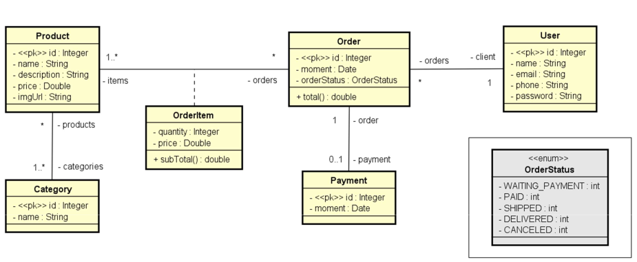
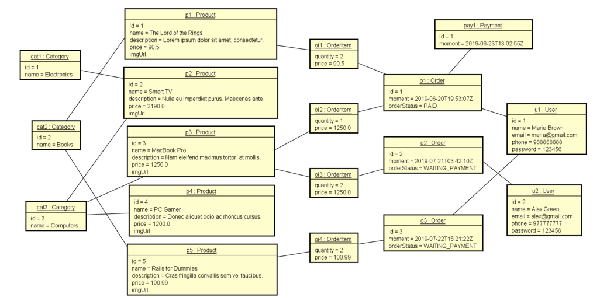

# Web Services Project with Spring Boot and JPA/Hibernate

Project developed with Spring Boot with the goal of creating a web services system.

### Domain Model


### Object Diagram


### Objectives:
- Create a Spring Boot Java project;
- Implement domain model;
- Structure logical layers: resource, service, repository;
- Configure a test database (H2);
- Populate the database;
- CRUD - Create, Retrieve, Update, Delete;
- Exception handling.

### Tools Used:
- Java 17;
- Maven;
- Spring Boot 3;
- H2 Database;
- Postman;
- PostgreSQL.

### Prerequisites

- **Java 17** installed on your machine.
- **Maven** installed to build the project.
- **PostgreSQL** configured if you want to use it in production.

### Installation

1. Clone the repository:

   ```bash
   git clone https://github.com/lucass-alvess/workshop-springboot3-jpa.git
   ```

2. Navigate to the project directory:

   ```bash
   cd workshop-springboot3-jpa
   ```

3. Build the project using Maven:

   ```bash
   mvn clean install
   ```

4. Run the application:

   ```bash
   mvn spring-boot:run
   ```
### API Testing

Use **Postman** to interact with the API endpoints provided by the application. The base URL for local testing is `http://localhost:8080`.

### Acknowledgements

Project carried out and developed in the [Complete Java](https://www.udemy.com/course/java-curso-completo/) Course on the Udemy platform, taught by Prof. Dr. Nelio Alves.
